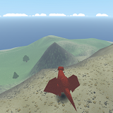
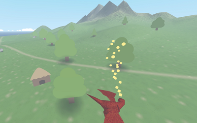

# Soar

Live the life of a dragon on a small island
* fly around
* terrorise villagers
* catch and feed wildlife to your hatchlings
* set fire to hungry leopards

Controls
* Mouse: look/aim
* Left Mouse Button: expel contents of stomach
* Space: jump/flap
* Hold Space: glide
* WASD (on ground): Move 
* W (while gliding): Turn to match camera

Flapping and gliding take the angle of the wing/body into account. Facing upward will brake, downward will accelerate. Use of a mouse (not a track pad and definitely not touch/mobile) is recommended.

Playable here https://madmaw.github.io/akitw/